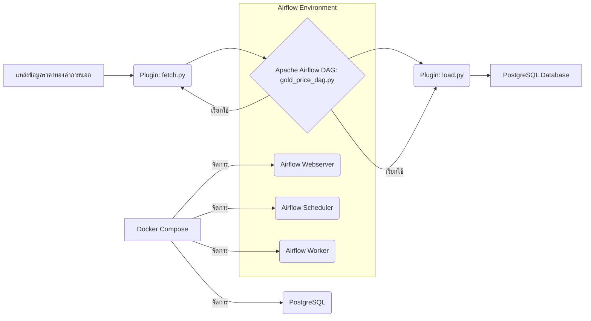

# โปรเจกต์ Airflow สำหรับการทำความเข้าใจ: เวิร์กโฟลว์ ETL ราคาทองคำ

โปรเจกต์นี้จัดทำขึ้นเพื่อสาธิตและทำความเข้าใจการทำงานของ Apache Airflow ในการจัดการเวิร์กโฟลว์ ETL (Extract, Transform, Load) สำหรับข้อมูลราคาทองคำ โดยใช้ Docker, Docker Compose และ PostgreSQL เป็นส่วนประกอบหลัก

## สถาปัตยกรรม (Architecture)

โปรเจกต์นี้ถูกออกแบบมาด้วยสถาปัตยกรรมที่เรียบง่ายเพื่อแสดงการทำงานของ Airflow ในการดึงข้อมูลจากแหล่งภายนอก ประมวลผล และจัดเก็บลงในฐานข้อมูล Diagram ด้านล่างแสดงภาพรวมของส่วนประกอบต่างๆ:



## การเริ่มต้น (First Time Setup)

หากคุณเพิ่งโคลน Repository นี้เป็นครั้งแรก ให้ทำตามขั้นตอนด้านล่างเพื่อเริ่มการทำงานของโปรเจกต์:

1.  **สร้างและรัน Docker Containers ทั้งหมด**: ใช้คำสั่งนี้เพื่อสร้างอิมเมจและรันคอนเทนเนอร์ทั้งหมดในโหมด `detached` (ทำงานในพื้นหลัง) พร้อมสร้างภาพใหม่หากมีการเปลี่ยนแปลง
    ```bash
    docker-compose up -d --build
    ```
    _หากต้องการรันใน foreground เพื่อดู log โดยตรง สามารถใช้ `docker-compose up --build` ได้_

## การจัดการ Airflow Project

### การหยุดการทำงาน (Stopping Containers)

หากคุณต้องการหยุดการทำงานของ Docker Containers:

*   **สำหรับคอนเทนเนอร์ที่รันในโหมด `detached` (-d)**:
    ```bash
    docker-compose stop
    ```
*   **สำหรับคอนเทนเนอร์ที่รันในโหมด `foreground`**: กด `Ctrl + C` ใน Terminal ที่กำลังรันอยู่ จากนั้นใช้คำสั่ง `docker-compose stop`

### การลบ (Deleting Containers และ Volumes)

หากคุณต้องการลบ Docker Containers, Network และ Volumes ที่เกี่ยวข้องกับโปรเจกต์ (เช่น เมื่อต้องการเริ่มใหม่ทั้งหมด):

```bash
docker-compose down -v
```
_คำสั่ง `-v` จะลบ Docker Volumes ซึ่งจะทำให้ข้อมูลในฐานข้อมูลถูกลบไปด้วย โปรดใช้ด้วยความระมัดระวัง_

## การเข้าสู่ระบบ Airflow Web UI

เมื่อ Airflow Containers ทำงานอยู่ คุณสามารถเข้าถึง Airflow Web UI ได้ที่ `http://localhost:8080` (หรือพอร์ตที่คุณตั้งค่าไว้)

*   **ชื่อผู้ใช้ (Username)**: `admin`
*   **รหัสผ่าน (Password)**: รหัสผ่านจะปรากฏใน **Log** ของคอนเทนเนอร์ `airflow-webserver` เมื่อคุณรันคอนเทนเนอร์เป็นครั้งแรกเท่านั้น
    *   หากคุณไม่เห็นรหัสผ่าน คุณอาจต้องลบคอนเทนเนอร์และ Volume ทั้งหมด (`docker-compose down -v`) และรันใหม่เพื่อดูรหัสผ่านอีกครั้ง

## การเรียกใช้ DAGs ด้วยตนเอง

หลังจากเข้าสู่ระบบ Airflow Web UI ได้แล้ว คุณสามารถไปที่หน้า `DAGs` เพื่อดู `gold_price_dag.py` และเรียกใช้งาน (Manual Trigger) DAG ได้ด้วยตนเอง จากนั้นตรวจสอบสถานะการทำงานและผลลัพธ์

## โครงสร้าง DAGs และ Plugins

### DAGs

*   [`airflow/dags/gold_price_dag.py`](airflow/dags/gold_price_dag.py): เป็น Directed Acyclic Graph (DAG) หลักของโปรเจกต์นี้ มีหน้าที่ในการจัดลำดับขั้นตอนการทำงานของ ETL สำหรับข้อมูลราคาทองคำ DAG นี้จะถูกตั้งค่าให้รันตามตารางเวลาที่กำหนด หรือสามารถเรียกใช้ด้วยตนเองได้

### Plugins

*   [`airflow/plugins/fetch.py`](airflow/plugins/fetch.py): เป็น Python Module ที่ทำหน้าที่ในการดึงข้อมูลราคาทองคำจากแหล่งข้อมูลภายนอก (เช่น API) โดยจะส่งคืนข้อมูลดิบที่พร้อมสำหรับการประมวลผลขั้นต่อไป
*   [`airflow/plugins/load.py`](airflow/plugins/load.py): เป็น Python Module ที่ทำหน้าที่ในการโหลดข้อมูลที่ผ่านการประมวลผลแล้วเข้าสู่ฐานข้อมูล PostgreSQL โดยจะจัดการกับการเชื่อมต่อฐานข้อมูลและการแทรกข้อมูลอย่างเหมาะสม

## Dependencies

โปรเจกต์นี้ใช้ Python Packages ที่ระบุไว้ในไฟล์ [`requirements.txt`](requirements.txt) ซึ่งจะถูกติดตั้งภายใน Docker Container ของ Airflow ในระหว่างกระบวนการ build

## การตรวจสอบข้อมูลในฐานข้อมูล (PostgreSQL)

ข้อมูลที่ถูกประมวลผลโดย DAG จะถูกจัดเก็บไว้ในฐานข้อมูล PostgreSQL คุณสามารถเข้าถึงฐานข้อมูลเพื่อตรวจสอบข้อมูลได้ดังนี้:

1.  **เปิด Docker Desktop (หรือ Terminal)**: ไปที่ส่วน `Containers` และหา Service ที่ชื่อว่า `postgres` (หรือชื่อที่คุณตั้งค่าไว้สำหรับฐานข้อมูล).
2.  **เข้าสู่โหมด `exec`**: คลิกที่ไอคอน `CLI` (Command Line Interface) สำหรับคอนเทนเนอร์ `postgres` หรือใช้คำสั่งใน Terminal:
    ```bash
    docker exec -it <ชื่อคอนเทนเนอร์_postgres> psql -U airflow -d gold_db
    ```
    _คุณสามารถหา `ชื่อคอนเทนเนอร์_postgres` ได้จาก `docker ps`_
3.  **คำสั่งตรวจสอบฐานข้อมูล**: เมื่อเข้าสู่ `psql` แล้ว คุณสามารถใช้คำสั่งต่อไปนี้:
    *   **ดูตารางทั้งหมด**: 
        ```sql
        \dt
        ```
    *   **คิวรี่ข้อมูลจากตาราง (ตัวอย่าง)**:
        ```sql
        SELECT * FROM gold_prices;
        ```
        _แทนที่ `gold_prices` ด้วยชื่อตารางที่คุณสนใจ_

## การพัฒนาเพิ่มเติม

หากคุณต้องการพัฒนาหรือแก้ไขโปรเจกต์นี้:

*   แก้ไขไฟล์ใน [`airflow/dags/`](airflow/dags/) เพื่อปรับแต่งหรือเพิ่ม DAGs ใหม่
*   แก้ไขไฟล์ใน [`airflow/plugins/`](airflow/plugins/) เพื่อปรับปรุงฟังก์ชันการดึงหรือโหลดข้อมูล
*   อัปเดต [`requirements.txt`](requirements.txt) หากมีการเพิ่ม Python package ใหม่
*   หลังจากแก้ไขโค้ด ให้รัน `docker-compose up -d --build` อีกครั้งเพื่อสร้างและรันคอนเทนเนอร์ใหม่พร้อมการเปลี่ยนแปลงของคุณ

## การแก้ไขปัญหาเบื้องต้น (Troubleshooting)

*   **Airflow UI เข้าไม่ได้**: ตรวจสอบให้แน่ใจว่าคอนเทนเนอร์ `airflow-webserver` กำลังทำงานอยู่ (`docker ps`)
*   **DAGs ไม่รัน**: ตรวจสอบว่า `airflow-scheduler` กำลังทำงาน และ DAG ถูก `unpaused` ใน Airflow UI
*   **Task ล้มเหลว**: ดู Log ของ Task ใน Airflow UI เพื่อหาสาเหตุของข้อผิดพลาด
*   **ฐานข้อมูลเชื่อมต่อไม่ได้**: ตรวจสอบว่าคอนเทนเนอร์ `postgres` กำลังทำงานอยู่ และการตั้งค่าการเชื่อมต่อในโค้ดถูกต้อง

_โปรเจกต์นี้ยังอยู่ในระหว่างการพัฒนาและปรับปรุง หากมีข้อเสนอแนะหรือพบปัญหา สามารถแจ้งได้_