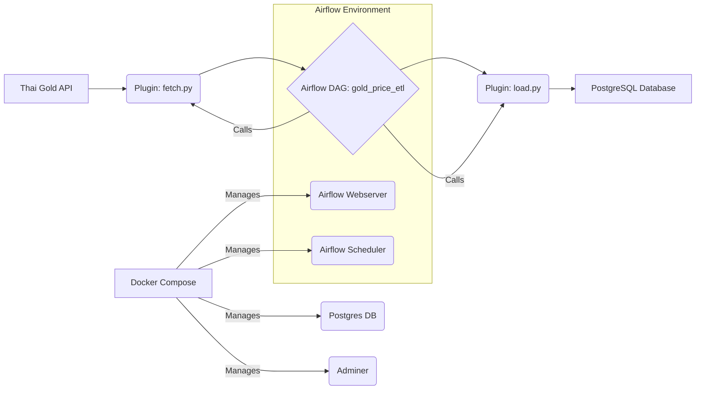

# Gold Price ETL with Apache Airflow

A comprehensive ETL (Extract, Transform, Load) project designed to demonstrate how Apache Airflow orchestrates data workflows. This project fetches real-time gold prices from a Thai Gold API, processes the data, and stores it in a PostgreSQL database using a containerized environment.

---

## 🏗️ Project Architecture

The project leverages a modern data stack to ensure reliability and ease of deployment.



---

## 🚀 Quick Start

Follow these steps to get the project up and running on your local machine.

### 1. Prerequisites
- [Docker](https://www.docker.com/get-started)
- [Docker Compose](https://docs.docker.com/compose/install/)

### 2. Launch the Environment
Clone the repository and run the following command to build and start all services in detached mode:

```bash
docker-compose up -d --build
```

---

## 🛠️ Project Management

### Stopping the Services
To stop the running containers without removing them:
```bash
docker-compose stop
```

### Resetting the Project
To stop and remove all containers, networks, and **volumes** (this will wipe the database):
```bash
docker-compose down -v
```

---

## 🌐 Accessing the Services

### 1. Airflow Web UI
- **URL**: [http://localhost:8080](http://localhost:8080)
- **Username**: `admin`
- **Password**: Found in the logs of the `airflow` container during the **first launch**.

> **Note**: To find the password, run:  
> `docker-compose logs airflow | grep "Password"`  
> If you missed it, you may need to run `docker-compose down -v` and start over.

### 2. Database (PostgreSQL)
You can inspect the data directly via the CLI or use the included **Adminer** web interface.

**Via Adminer (Web GUI):**
- **URL**: [http://localhost:8081](http://localhost:8081)
- **System**: PostgreSQL
- **Server**: `postgres`
- **User/Password/DB**: Defined in your environment variables (default: `airflow`/`airflow`/`gold_db`).

**Via Terminal:**
```bash
docker exec -it <postgres_container_name> psql -U airflow -d gold_db
```
Common commands:
- `\dt`: List all tables.
- `SELECT * FROM gold_price;`: View fetched gold prices.

---

## 📂 Project Structure

- `airflow/dags/`: Contains `gold_price_dag.py` (The orchestration logic).
- `airflow/plugins/`: 
    - `fetch.py`: Logic for API data retrieval.
    - `load.py`: Logic for cleaning and database insertion.
- `airflow/scripts/`: Contains `init_db.sql` for automatic schema creation.
- `airflow/shared/`: A shared volume for temporary data storage between tasks.
- `utils/`: Utility scripts for API testing.

---

## 🔮 Roadmap
- [ ] Add data validation using Great Expectations.
- [ ] Implement Slack/Email notifications for DAG failures.
- [ ] Add a visualization dashboard using Grafana or Metabase.
- [ ] Support for historical data backfilling.

---

## 🤝 Contributing
Contributions are welcome! Please feel free to submit a Pull Request.
